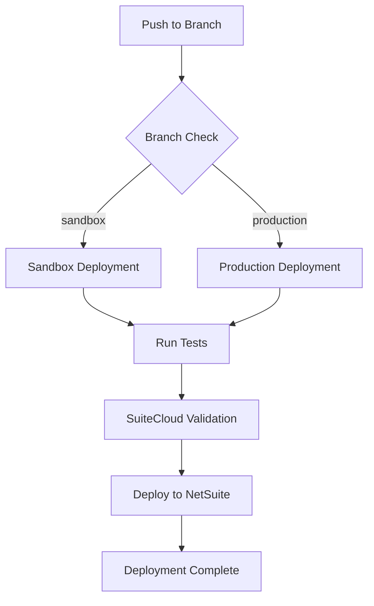

# 🚀 NetSuite SuiteScript Account Customization Project

<div align="center">


</div>

## 🔄 Workflow Status

| Environment    | Status                                                                                                                                       |
| -------------- | -------------------------------------------------------------------------------------------------------------------------------------------- |
| **Production** |  |
| **Sandbox**    |        |

## 📋 Table of Contents

- [🎯 Overview](#-overview)
- [🏗️ Project Structure](#️-project-structure)
- [🛠️ Development Setup](#️-development-setup)
- [📝 SuiteScript Naming Conventions](#-suitescript-naming-conventions)
- [🔧 SuiteCloud Extension Setup](#-suitecloud-extension-setup)
- [🚀 Getting Started](#-getting-started)
- [🧪 Testing](#-testing)
- [🔒 Security & Authentication](#-security--authentication)
- [📦 Deployment](#-deployment)
- [🤝 Contributing](#-contributing)

## 🎯 Overview

This repository contains comprehensive SuiteScript customizations for NetSuite account management, designed to enhance functionality, maintain scalability, and streamline business processes. The project includes various script types including User Events, Client Scripts, Suitelets, Restlets, and Map/Reduce scripts.

### ✨ Key Features

- 🔄 **Automated CI/CD Pipeline** - Continuous integration and deployment to Sandbox and Production environments
- 📊 **Advanced Reporting** - Custom reporting solutions with enhanced analytics
- 🛒 **Marketplace Integrations** - Support for multiple e-commerce platforms (Amazon, Liverpool, Walmart, etc.)
- 📦 **Inventory Management** - Comprehensive inventory tracking and management tools
- 🧾 **Document Management** - Automated invoice processing and document generation
- 🔍 **Monitoring & Logging** - Real-time monitoring and error tracking capabilities

## 🏗️ Project Structure

```
├── src/                          # Source code directory
│   ├── FileCabinet/             # NetSuite File Cabinet structure
│   │   └── SuiteScripts/        # All SuiteScript files
│   │       ├── Jinim/           # Main organization folder
│   │       │   ├── Suitescript_2.x/  # SuiteScript 2.x implementations
│   │       │   │   ├── Common/       # Shared utilities and libraries
│   │       │   │   ├── Process/      # Background processing scripts
│   │       │   │   └── Services/     # API and service scripts
│   │       │   └── Suitescript_1.0/  # Legacy SuiteScript 1.0 (deprecated)
│   │       ├── Client/          # Client-side scripts
│   │       ├── UserEvent/       # Server-side event scripts
│   │       ├── Suitelet/        # Web interface scripts
│   │       ├── MapReduce/       # Batch processing scripts
│   │       └── Restlet/         # API endpoint scripts
│   └── Objects/                 # NetSuite configuration objects
│       ├── CustomRecords/       # Custom record definitions
│       ├── SavedSearches/       # Saved search configurations
│       └── ...                  # Other NetSuite objects
├── __test__/                    # Test files and specifications
├── .github/workflows/           # GitHub Actions CI/CD workflows
└── package.json                 # Node.js dependencies and scripts
```

## 🛠️ Development Setup

### Prerequisites

Before you begin, ensure you have the following installed:

- **Oracle JDK 17** - Required for SuiteCloud SDK
- **Node.js 16.x** - JavaScript runtime
- **Visual Studio Code 1.91.1+** - Recommended IDE
- **Git** - Version control

### Quick Start

1. **Clone the repository**

   ```bash
   git clone https://github.com/Avera-MX/netsuite-suitescript-acp.git
   cd netsuite-suitescript-acp
   ```

2. **Install dependencies**

   ```bash
   npm install
   ```

3. **Install SuiteCloud CLI globally**

   ```bash
   npm install -g @oracle/suitecloud-cli
   ```

4. **Run tests**
   ```bash
   npm test
   ```

## 📝 SuiteScript Naming Conventions

To ensure consistency and scalability when creating new NetSuite objects, please adhere to these naming conventions:

### 🏷️ Internal IDs

**Structure:** `_jnm_DESCRIPTION_ABBR`

- **`DESCRIPTION`**: Lowercase, concise description of the script's purpose
- **`ABBR`**: Script type abbreviation (see table below)

**Example:** `_jnm_invoice_processor_ue`

### 📛 Script Names

**Structure:** `Jinim - SHORT DESCRIPTION - ABBR`

- **`SHORT DESCRIPTION`**: Clear, descriptive name of the script
- **`ABBR`**: Script type abbreviation

**Example:** `Jinim - Invoice Processor - UE`

### 📊 Script Type Abbreviations

| Script Type   | Abbreviation | Purpose                           |
| ------------- | ------------ | --------------------------------- |
| User Event    | UE           | Server-side record event handling |
| Client Script | CS           | Client-side form interactions     |
| Suitelet      | ST           | Web interfaces and forms          |
| Restlet       | RT           | RESTful API endpoints             |
| Map/Reduce    | MR           | Batch data processing             |
| Scheduled     | SC           | Time-based automated tasks        |
| Portlet       | PT           | Dashboard widgets                 |

## 🔧 SuiteCloud Extension Setup

### What is SuiteCloud Extension?

The SuiteCloud Extension for Visual Studio Code is an official Oracle extension that provides comprehensive tools for NetSuite development. It's part of the SuiteCloud Software Development Kit (SuiteCloud SDK) and enables you to:

- **Develop and Deploy SuiteScript** - Create, test, and deploy custom scripts directly from VS Code
- **Manage Account Customization Projects (ACP)** - Full lifecycle management for NetSuite customizations
- **Build SuiteApps** - Develop packaged applications for the SuiteApp Marketplace
- **Local Development Environment** - Work offline with local project structure and validation
- **Integrated Testing** - Built-in unit testing framework with Jest integration

### ✨ Key Features

#### 🔍 **IntelliSense Support**

- Auto-completion for SuiteScript APIs
- Real-time syntax validation
- Contextual documentation and examples
- Type definitions for NetSuite modules

#### 🧪 **Testing Framework**

- Integrated Jest testing environment
- SuiteScript-specific test utilities
- Automated test execution on deployment
- Coverage reporting and analysis

#### 🚀 **Deployment Management**

- Direct deployment to NetSuite environments
- Environment-specific configurations
- Automated validation before deployment
- Rollback capabilities

#### 🔐 **Authentication Methods**

- Token-based authentication (TBA)
- OAuth 2.0 certificate authentication
- Browser-based authentication for development

### 📥 Installation & Setup

#### Step 1: Install Prerequisites

Ensure you have the following installed:

```bash
# Java Development Kit (JDK) 17 or higher
java --version

# Node.js 16.x or higher
node --version

# Visual Studio Code 1.60.0 or higher
code --version
```

#### Step 2: Install the Extension

1. **From VS Code Marketplace**

   - Open VS Code
   - Navigate to Extensions (`Ctrl+Shift+X` / `Cmd+Shift+P`)
   - Search for "SuiteCloud Extension for Visual Studio Code"
   - Click **Install** and restart VS Code

2. **From Command Line**
   ```bash
   code --install-extension Oracle.suitecloud-vscode-extension
   ```

#### Step 3: Install SuiteCloud CLI

The extension requires the SuiteCloud CLI to be installed globally:

```bash
npm install -g @oracle/suitecloud-cli
```

Verify installation:

```bash
suitecloud --version
```

#### Step 4: Verify Installation

1. Open VS Code Command Palette (`Ctrl+Shift+P` / `Cmd+Shift+P`)
2. Type "SuiteCloud" to see available commands
3. You should see commands like:
   - `SuiteCloud: Create Project`
   - `SuiteCloud: Set Up Account`
   - `SuiteCloud: Deploy Project`
   - `SuiteCloud: Run Tests`

### 🔧 Project Configuration

#### Account Customization Project (ACP)

This project type is ideal for:

- Custom business logic implementation
- NetSuite account-specific customizations
- Integration with third-party systems
- Workflow automation

#### Setting Up Authentication

##### Method 1: Token-Based Authentication (Recommended for Production)

1. **Generate Integration Record in NetSuite**

   - Go to `Setup → Integrations → Manage Integrations → New`
   - Enable "Token-Based Authentication"
   - Note the Consumer Key and Consumer Secret

2. **Create Access Token**

   - Go to `Setup → Users/Roles → Access Tokens → New`
   - Select your integration and user
   - Note the Token ID and Token Secret

3. **Configure in VS Code**
   ```bash
   # Open Command Palette and run:
   SuiteCloud: Set Up Account
   ```

##### Method 2: OAuth 2.0 Certificate Authentication

1. **Generate Certificate Pair**

   ```bash
   # Generate private key
   openssl genrsa -out private-key.pem 2048

   # Generate certificate signing request
   openssl req -new -key private-key.pem -out certificate.csr

   # Generate self-signed certificate
   openssl x509 -req -days 365 -in certificate.csr -signkey private-key.pem -out certificate.pem
   ```

2. **Upload Certificate to NetSuite**

   - Navigate to `Setup → Integration → OAuth 2.0 Client Credentials (M2M) Setup`
   - Create new certificate credential
   - Upload your certificate file
   - Configure application mapping

3. **Configure Project**
   ```bash
   suitecloud account:setup
   ```

##### Method 3: Browser-Based Authentication (Development Only)

Best for development and testing environments:

1. Run the setup command:

   ```bash
   suitecloud account:setup
   ```

2. Select "Browser-based authentication"
3. Follow the browser prompts to authenticate

### 🎯 Working with the Extension

#### Creating a New Project

1. **From Command Palette**

   ```
   SuiteCloud: Create Project
   ```

2. **From Terminal**

   ```bash
   suitecloud project:create -i
   ```

3. **Choose Project Type**
   - Account Customization Project (ACP)
   - SuiteApp

#### Project Structure

```
your-project/
├── src/                          # Source files
│   ├── FileCabinet/             # File Cabinet structure
│   │   └── SuiteScripts/        # Your SuiteScript files
│   └── Objects/                 # NetSuite objects (records, fields, etc.)
├── .vscode/                     # VS Code settings
├── suitecloud.config.js         # SuiteCloud configuration
├── jest.config.js               # Testing configuration
└── package.json                 # Node.js dependencies
```

#### Available Commands

| Command                            | Description                               |
| ---------------------------------- | ----------------------------------------- |
| `SuiteCloud: Create Project`       | Initialize new SuiteCloud project         |
| `SuiteCloud: Set Up Account`       | Configure NetSuite account authentication |
| `SuiteCloud: Deploy Project`       | Deploy customizations to NetSuite         |
| `SuiteCloud: Compare with Account` | Compare local with remote changes         |
| `SuiteCloud: Import Objects`       | Import existing NetSuite objects          |
| `SuiteCloud: Validate Project`     | Validate project structure and syntax     |
| `SuiteCloud: Run Tests`            | Execute unit tests                        |

### 🧪 Testing Integration

The extension includes integrated testing capabilities:

#### Test Configuration

The project automatically configures Jest for SuiteScript testing:

```javascript
// jest.config.js
const SuiteCloudJestConfiguration = require("@oracle/suitecloud-unit-testing/jest-configuration/SuiteCloudJestConfiguration");

module.exports = SuiteCloudJestConfiguration.build({
  projectFolder: "src",
  projectType: SuiteCloudJestConfiguration.ProjectType.ACP,
});
```

#### Running Tests

1. **From Command Palette**

   ```
   SuiteCloud: Run Tests
   ```

2. **From Terminal**

   ```bash
   npm test
   ```

3. **With Coverage**
   ```bash
   npm run test:coverage
   ```

### 🔍 Debugging and Troubleshooting

#### Common Issues

1. **Extension Not Loading**

   - Ensure JDK 17+ is installed and in PATH
   - Restart VS Code after installation
   - Check VS Code version compatibility

2. **Authentication Failures**

   - Verify NetSuite account credentials
   - Check network connectivity
   - Ensure proper permissions in NetSuite

3. **Deployment Issues**
   - Run `suitecloud project:validate` first
   - Check for syntax errors in scripts
   - Verify required dependencies are included

#### Debug Logs

Enable debug logging:

```bash
# Set environment variable
export SUITECLOUD_LOG_LEVEL=debug

# Or in VS Code settings
"suitecloud.logLevel": "debug"
```

### 📚 Additional Resources

- **[SuiteCloud SDK Documentation](https://docs.oracle.com/en/cloud/saas/netsuite/ns-online-help/chapter_156026236161.html)**
- **[SuiteScript 2.x API Reference](https://docs.oracle.com/en/cloud/saas/netsuite/ns-online-help/set_1502135122.html)**
- **[NetSuite Developer Portal](https://developers.netsuite.com/)**
- **[SuiteCloud CLI Commands](https://docs.oracle.com/en/cloud/saas/netsuite/ns-online-help/bridgehead_4702656043.html)**

## 🚀 Getting Started

### 🔐 Setting Up Authentication

#### Method 1: Certificate-Based Authentication (Recommended)

1. **Generate Certificate Pair**

   ```bash
   openssl req -x509 -newkey rsa:4096 -sha256 -keyout private-key.pem -out public-cert.pem -nodes -days 730
   ```

2. **Upload Certificate to NetSuite**

   Navigate to: `Setup → Integration → Manage Authentication → OAuth 2.0 Client Credentials (M2M) Setup`

   - Click "Create New"
   - Upload your public certificate (`public-cert.pem`)
   - Map to appropriate entity, role, and application

3. **Configure Application Integration**

#### Method 2: Browser-Based Authentication

Suitable for development environments with less strict security requirements.

### 🔧 Configure Your Account

1. **Open Command Palette** (`Ctrl+Shift+P` / `Cmd+Shift+P`)
2. **Run:** `SuiteCloud: Set Up Account`
3. **Choose Authentication Method:**
   - Select "Machine-to-machine authentication" for production
   - Select "Browser-based authentication" for development
4. **Enter Required Information:**
   - Authentication ID
   - Account ID (for M2M)
   - Certificate ID (for M2M)
   - Private key file path (for M2M)

### 📁 Project Configuration

#### 🔧 Environment Variables Setup

This project uses environment variables for secure configuration management. Set up the following environment variables in your system or create a `.env` file:

**Required Environment Variables:**

- `ACCOUNT_ID` - Your NetSuite Production Account ID
- `SB1_ACCOUNT_ID` - Your NetSuite Sandbox Account ID
- `CERTIFICATE_ID` - OAuth Certificate ID
- `JINIMTECHUSER_KEY` - Private key content (paste the entire PEM file content)
- `PRD_DOMAIN` / `SB_DOMAIN` - Environment domains

#### 📋 Configuration Files Overview

```
├── suitecloud.config.js       # SuiteCloud SDK configuration
├── jest.config.js             # Testing configuration
├── jsconfig.json              # JavaScript configuration
├── package.json               # Node.js dependencies
└── .gitignore                 # Git ignore patterns
```

**Setting up locally:**

1. **Create environment file** (optional)

   ```bash
   cp .env.example .env
   # Edit .env with your credentials
   ```

2. **Configure SuiteCloud account**

   ```bash
   suitecloud account:setup
   ```

3. **Validate project**
   ```bash
   suitecloud project:validate
   ```

## 🧪 Testing

We use Jest for unit testing with comprehensive coverage reporting.

### Running Tests

```bash
# Run all tests
npm test

# Run tests with coverage
npm run test:coverage

# Run specific test file
npm test -- __test__/specific-test.spec.js
```

### Test Structure

- `__test__/` - Main test directory
- `__test__/constants-test/` - Tests for utility constants
- `__test__/utility-test/` - Tests for utility functions
- Individual test files for specific modules

### Writing Tests

Follow the existing patterns in the test files. Example test structure:

```javascript
// Mock dependencies
jest.mock("N/log");
const mockModule = require("../src/path/to/module");

describe("Module Name", () => {
  test("should perform expected behavior", () => {
    // Test implementation
  });
});
```

## 🔒 Security & Authentication

### 🔑 Environment Variables

Sensitive information is managed through environment variables or GitHub Secrets:

- `ACCOUNT_ID` / `SB1_ACCOUNT_ID` - NetSuite account identifiers
- `CERTIFICATE_ID` - OAuth certificate ID
- `JINIMTECHUSER_KEY` - Private key for authentication
- `PRD_DOMAIN` / `SB_DOMAIN` - Environment domains
- `NTST_SUITECLOUD_CI_PASSKEY` - CI/CD passkey

### 🛡️ Best Practices

- Never commit sensitive information to the repository
- Use environment-specific configurations
- Regularly rotate certificates and keys
- Follow principle of least privilege for role assignments

## 📦 Deployment

### 🔄 Automated Deployment

The project uses GitHub Actions for automated deployment with a comprehensive CI/CD pipeline:

**Workflow Overview:**



**Deployment Triggers:**

- **Sandbox Deployment** - Triggered on pushes to `sandbox` branch
- **Production Deployment** - Triggered on pushes to `production` branch
- **Pull Request Validation** - Runs tests and validation on PRs


_GitHub Actions workflow status in repository_

### 🚀 Manual Deployment

For manual deployments using SuiteCloud CLI:

```bash
# Deploy to configured account
suitecloud project:deploy --accountspecificvalues WARNING

# Deploy with specific authentication
suitecloud project:deploy --authid YOUR_AUTH_ID
```

### 📋 Deployment Checklist

- [ ] All tests passing
- [ ] Code review completed
- [ ] Environment variables configured
- [ ] Backup created (for production)
- [ ] Rollback plan prepared

## 🤝 Contributing

### 🌿 Branch Strategy

- `main` - Protected, production-ready code
- `production` - Production deployment branch
- `sandbox` - Sandbox deployment branch
- `feature/*` - Feature development branches
- `hotfix/*` - Emergency fixes

### 📝 Pull Request Process

1. Create feature branch from `sandbox`
2. Implement changes with tests
3. Ensure all tests pass
4. Submit PR to `sandbox` branch
5. After approval, merge to `sandbox`
6. For production: Create PR from `sandbox` to `production`

### 🏷️ Commit Message Format

```
type(scope): description

[optional body]

[optional footer]
```

**Types:** feat, fix, docs, style, refactor, test, chore

**Example:**

```
feat(invoice): add automated invoice processing

Implements automated invoice generation for marketplace orders
with support for multiple tax calculations.

Closes #123
```

### 🧪 Code Quality

- Follow existing code patterns and conventions
- Add unit tests for new functionality
- Ensure JSDoc comments for all functions
- Run linting before submitting PRs

## 🔧 Troubleshooting

### Common Issues and Solutions

#### 1. Authentication Failures

**Problem:** Certificate authentication fails

```
Error: INVALID_LOGIN_CREDENTIALS
```

**Solution:**

1. Verify certificate is correctly uploaded to NetSuite
2. Check that certificate ID matches in your configuration
3. Ensure private key file is accessible and properly formatted

#### 2. Deployment Issues

**Problem:** Deployment fails with validation errors

```
Error: INVALID_SCRIPT_ID
```

**Solution:**

1. Check SuiteScript naming conventions are followed
2. Verify all required dependencies are included
3. Run local validation: `suitecloud project:validate`

#### 3. Environment Setup

**Problem:** SuiteCloud CLI not found

```
Command 'suitecloud' not found
```

**Solution:**

```bash
npm install -g @oracle/suitecloud-cli
```

#### 4. Node.js Version Issues

**Problem:** Compatibility issues with Node.js

```
Error: Unsupported Node.js version
```

**Solution:**

1. Install Node.js 16.x using nvm:
   ```bash
   nvm install 16
   nvm use 16
   ```

### 📞 Getting Help

- **NetSuite SuiteCloud Documentation:** [docs.oracle.com/netsuite](https://docs.oracle.com/en/cloud/saas/netsuite/ns-online-help/)
- **Project Issues:** Create an issue in this repository
- **SuiteCloud Community:** [NetSuite Developer Community](https://community.oracle.com/netsuite/)

## 📚 Additional Resources

- [NetSuite SuiteCloud SDK Documentation](https://docs.oracle.com/en/cloud/saas/netsuite/ns-online-help/chapter_156026236161.html)
- [SuiteScript 2.x API Documentation](https://docs.oracle.com/en/cloud/saas/netsuite/ns-online-help/set_1502135122.html)
- [SuiteCloud Development Framework](https://docs.oracle.com/en/cloud/saas/netsuite/ns-online-help/section_4702656040.html)

---

<div align="center">

**Made with ❤️ by the Avera Engineering Team**

</div>
