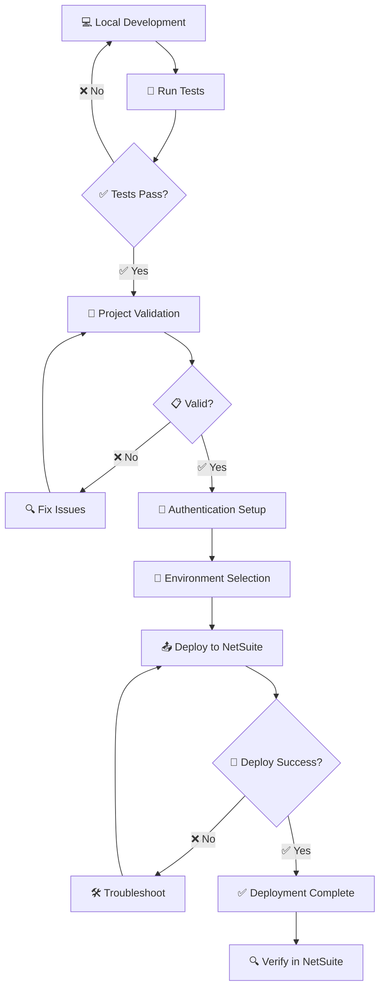

# 🚀 NetSuite SuiteScript Demo Project

<div align="center">


</div>

## 📋 Table of Contents

- [🎯 Overview](#-overview)
- [🏗️ Project Structure](#️-project-structure)
- [🛠️ Development Setup](#️-development-setup)
- [📝 SuiteScript Naming Conventions](#-suitescript-naming-conventions)
- [🔧 SuiteCloud Extension Setup](#-suitecloud-extension-setup)
- [🧪 Testing](#-testing)
- [🔒 Security & Authentication](#-security--authentication)
- [📦 Deployment Workflow](#-deployment-workflow)
  - [🔄 Deployment Process Overview](#-deployment-process-overview)
  - [🏗️ Environment Architecture](#️-environment-architecture)
  - [🔐 Authentication Methods](#-authentication-methods)
  - [📋 Step-by-Step Deployment Process](#-step-by-step-deployment-process)
  - [🎯 Environment-Specific Deployment](#-environment-specific-deployment)
  - [🚨 Error Handling & Troubleshooting](#-error-handling--troubleshooting)
  - [✅ Deployment Checklist](#-deployment-checklist)
  - [🔄 Rollback Procedures](#-rollback-procedures)
  - [🚀 Advanced Deployment Options](#-advanced-deployment-options)
  - [📊 Deployment Best Practices](#-deployment-best-practices)
- [🤝 Contributing](#-contributing)
- [🔧 Troubleshooting](#-troubleshooting)
- [📚 Additional Resources](#-additional-resources)

## 🎯 Overview

This repository contains a simple NetSuite SuiteApp demo project built with SuiteScript 2.1. It serves as a starting point for NetSuite development, featuring a basic Suitelet example and comprehensive testing setup using Jest.

### ✨ Key Features

- 📝 **Hello World Suitelet** - Basic Suitelet demonstrating form creation and HTML rendering
- 🧪 **Jest Testing Framework** - Complete test setup with SuiteCloud unit testing utilities
- 🏗️ **SuiteApp Structure** - Proper SuiteApp organization under `com.netsuite.averademo` namespace
- 🔧 **Development Ready** - Pre-configured for immediate NetSuite development

## 🏗️ Project Structure

```
├── src/                          # Source code directory
│   ├── FileCabinet/             # NetSuite File Cabinet structure
│   │   └── SuiteApps/           # SuiteApp namespace structure
│   │       └── com.netsuite.averademo/  # Demo SuiteApp namespace
│   │           ├── common/       # Common utilities (placeholder)
│   │           ├── process/      # Process scripts (placeholder)
│   │           └── services/     # Service layer scripts
│   │               ├── restlet/  # RESTlet scripts (placeholder)
│   │               └── suitelet/ # Suitelet scripts
│   │                   └── HelloWorld.Suitelet.js  # Demo Suitelet
│   ├── InstallationPreferences/ # SuiteApp installation preferences
│   └── Objects/                 # NetSuite configuration objects
│       └── customscript_jnm_helloworld_st.xml  # Hello World script record
├── __tests__/                   # Test files and specifications
│   └── sample-test.js           # Example Jest tests with NetSuite mocks
├── jest.config.js               # Jest configuration for SuiteScript testing
├── suitecloud.config.js         # SuiteCloud SDK configuration
├── jsconfig.json               # JavaScript/TypeScript configuration
└── package.json                 # Node.js dependencies and scripts
```

## 🛠️ Development Setup

### Prerequisites

Before you begin, ensure you have the following installed:

- **Oracle JDK 17** - Required for SuiteCloud SDK
- **Node.js 20.x** - JavaScript runtime
- **Visual Studio Code 1.91.1+** - Recommended IDE
- **Git** - Version control

### Quick Start

1. **Clone the repository**

   ```bash
   git clone <your-repo-url>
   cd <your-project-name>
   ```

2. **Install dependencies**

   ```bash
   npm install
   ```

3. **Install SuiteCloud CLI globally**

   ```bash
   npm install -g @oracle/suitecloud-cli
   ```

4. **Run tests**
   ```bash
   npm test
   ```

### What's Included

This demo project includes:

- **HelloWorld Suitelet** - A basic Suitelet that renders a styled "Hello World" form
- **Sample Tests** - Jest tests demonstrating NetSuite module mocking and testing patterns
- **SuiteCloud Configuration** - Pre-configured for SuiteApp development and deployment

## 📝 SuiteScript Naming Conventions

To ensure consistency and scalability when creating new NetSuite objects, please adhere to these naming conventions:

### 🏷️ Internal IDs

**Structure:** `_jnm_DESCRIPTION_ABBR`

- **`DESCRIPTION`**: Lowercase, concise description of the script's purpose
- **`ABBR`**: Script type abbreviation (see table below)

**Example:** `_jnm_invoice_processor_ue`

### 📛 Script Names

**Structure:** `Jinim - SHORT DESCRIPTION - ABBR`

- **`SHORT DESCRIPTION`**: Clear, descriptive name of the script
- **`ABBR`**: Script type abbreviation

**Example:** `Jinim - Invoice Processor - UE`

### 📊 Script Type Abbreviations

| Script Type   | Abbreviation | Purpose                           |
| ------------- | ------------ | --------------------------------- |
| User Event    | UE           | Server-side record event handling |
| Client Script | CS           | Client-side form interactions     |
| Suitelet      | ST           | Web interfaces and forms          |
| Restlet       | RT           | RESTful API endpoints             |
| Map/Reduce    | MR           | Batch data processing             |
| Scheduled     | SC           | Time-based automated tasks        |
| Portlet       | PT           | Dashboard widgets                 |

## 🔧 SuiteCloud Extension Setup

### What is SuiteCloud Extension?

The SuiteCloud Extension for Visual Studio Code is an official Oracle extension that provides comprehensive tools for NetSuite development. It's part of the SuiteCloud Software Development Kit (SuiteCloud SDK) and enables you to:

- **Develop and Deploy SuiteScript** - Create, test, and deploy custom scripts directly from VS Code
- **Manage Account Customization Projects (ACP)** - Full lifecycle management for NetSuite customizations
- **Build SuiteApps** - Develop packaged applications for the SuiteApp Marketplace
- **Local Development Environment** - Work offline with local project structure and validation
- **Integrated Testing** - Built-in unit testing framework with Jest integration

### ✨ Key Features

#### 🔍 **IntelliSense Support**

- Auto-completion for SuiteScript APIs
- Real-time syntax validation
- Contextual documentation and examples
- Type definitions for NetSuite modules

#### 🧪 **Testing Framework**

- Integrated Jest testing environment
- SuiteScript-specific test utilities
- Automated test execution on deployment
- Coverage reporting and analysis

#### 🚀 **Deployment Management**

- Direct deployment to NetSuite environments
- Environment-specific configurations
- Automated validation before deployment
- Rollback capabilities

#### 🔐 **Authentication Methods**

- Token-based authentication (TBA)
- OAuth 2.0 certificate authentication
- Browser-based authentication for development

### 📥 Installation & Setup

#### Step 1: Install Prerequisites

Ensure you have the following installed:

```bash
# Java Development Kit (JDK) 17 or higher
java --version

# Node.js 20.x or higher
node --version

# Visual Studio Code 1.60.0 or higher
code --version
```

#### Step 2: Install the Extension

1. **From VS Code Marketplace**

   - Open VS Code
   - Navigate to Extensions (`Ctrl+Shift+X` / `Cmd+Shift+P`)
   - Search for "SuiteCloud Extension for Visual Studio Code"
   - Click **Install** and restart VS Code

2. **From Command Line**
   ```bash
   code --install-extension Oracle.suitecloud-vscode-extension
   ```

#### Step 3: Install SuiteCloud CLI

The extension requires the SuiteCloud CLI to be installed globally:

```bash
npm install -g @oracle/suitecloud-cli
```

Verify installation:

```bash
suitecloud --version
```

#### Step 4: Verify Installation

1. Open VS Code Command Palette (`Ctrl+Shift+P` / `Cmd+Shift+P`)
2. Type "SuiteCloud" to see available commands
3. You should see commands like:
   - `SuiteCloud: Create Project`
   - `SuiteCloud: Set Up Account`
   - `SuiteCloud: Deploy Project`
   - `SuiteCloud: Run Tests`

### 🔧 Project Configuration

#### Account Customization Project (ACP)

This project type is ideal for:

- Custom business logic implementation
- NetSuite account-specific customizations
- Integration with third-party systems
- Workflow automation

#### Setting Up Authentication

##### Method 1: Token-Based Authentication (Recommended for Production)

1. **Generate Integration Record in NetSuite**

   - Go to `Setup → Integrations → Manage Integrations → New`
   - Enable "Token-Based Authentication"
   - Note the Consumer Key and Consumer Secret

2. **Create Access Token**

   - Go to `Setup → Users/Roles → Access Tokens → New`
   - Select your integration and user
   - Note the Token ID and Token Secret

3. **Configure in VS Code**
   ```bash
   # Open Command Palette and run:
   SuiteCloud: Set Up Account
   ```

##### Method 2: OAuth 2.0 Certificate Authentication

1. **Generate Certificate Pair**

   ```bash
   # Generate private key
   openssl genrsa -out private-key.pem 2048

   # Generate certificate signing request
   openssl req -new -key private-key.pem -out certificate.csr

   # Generate self-signed certificate
   openssl x509 -req -days 365 -in certificate.csr -signkey private-key.pem -out certificate.pem
   ```

2. **Upload Certificate to NetSuite**

   - Navigate to `Setup → Integration → OAuth 2.0 Client Credentials (M2M) Setup`
   - Create new certificate credential
   - Upload your certificate file
   - Configure application mapping

3. **Configure Project**
   ```bash
   suitecloud account:setup
   ```

##### Method 3: Browser-Based Authentication (Development Only)

Best for development and testing environments:

1. Run the setup command:

   ```bash
   suitecloud account:setup
   ```

2. Select "Browser-based authentication"
3. Follow the browser prompts to authenticate

### 🎯 Working with the Extension

#### Creating a New Project

1. **From Command Palette**

   ```
   SuiteCloud: Create Project
   ```

2. **From Terminal**

   ```bash
   suitecloud project:create -i
   ```

3. **Choose Project Type**
   - Account Customization Project (ACP)
   - SuiteApp

#### Available Commands

| Command                            | Description                               |
| ---------------------------------- | ----------------------------------------- |
| `SuiteCloud: Create Project`       | Initialize new SuiteCloud project         |
| `SuiteCloud: Set Up Account`       | Configure NetSuite account authentication |
| `SuiteCloud: Deploy Project`       | Deploy customizations to NetSuite         |
| `SuiteCloud: Compare with Account` | Compare local with remote changes         |
| `SuiteCloud: Import Objects`       | Import existing NetSuite objects          |
| `SuiteCloud: Validate Project`     | Validate project structure and syntax     |
| `SuiteCloud: Run Tests`            | Execute unit tests                        |


### 🔍 Debugging and Troubleshooting

#### Common Issues

1. **Extension Not Loading**

   - Ensure JDK 17+ is installed and in PATH
   - Restart VS Code after installation
   - Check VS Code version compatibility

2. **Authentication Failures**

   - Verify NetSuite account credentials
   - Check network connectivity
   - Ensure proper permissions in NetSuite

3. **Deployment Issues**
   - Run `suitecloud project:validate` first
   - Check for syntax errors in scripts
   - Verify required dependencies are included

#### Debug Logs

Enable debug logging:

```bash
# Set environment variable
export SUITECLOUD_LOG_LEVEL=debug

# Or in VS Code settings
"suitecloud.logLevel": "debug"
```

### 📚 Additional Resources

- **[SuiteCloud SDK Documentation](https://docs.oracle.com/en/cloud/saas/netsuite/ns-online-help/chapter_156026236161.html)**
- **[SuiteScript 2.x API Reference](https://docs.oracle.com/en/cloud/saas/netsuite/ns-online-help/set_1502135122.html)**
- **[NetSuite Developer Portal](https://developers.netsuite.com/)**
- **[SuiteCloud CLI Commands](https://docs.oracle.com/en/cloud/saas/netsuite/ns-online-help/bridgehead_4702656043.html)**

## 🧪 Testing

We use Jest for unit testing with SuiteCloud's testing framework for comprehensive NetSuite module mocking and testing scenarios.

### Running Tests

```bash
# Run all tests
npm test

# Run tests in watch mode (for development)
npm test -- --watch

# Run specific test file
npm test -- __tests__/suitelet.test.js

# Run tests with coverage
npm test -- --coverage
```

### Test Structure

- `__tests__/` - Main test directory containing 30+ tests across 6 test suites
- `sample-test.js` - Basic Jest examples with string assertions and record operations
- `suitelet.test.js` - Tests for Suitelet functionality and form creation
- `record-operations.test.js` - Comprehensive NetSuite record CRUD operations
- `search-operations.test.js` - NetSuite search functionality and saved searches
- `user-event.test.js` - User Event script scenarios (beforeLoad, beforeSubmit, afterSubmit)
- `utility-functions.test.js` - Common utility functions for NetSuite development

### Test Coverage

Our comprehensive test suite covers:

#### 🎯 **Suitelet Testing**
- Form creation and field configuration
- HTML content rendering
- Request/response handling
- Server widget interactions

#### 📝 **Record Operations**
- Creating new records (Customer, Sales Order, Items)
- Loading and updating existing records
- Sublist operations and line items
- Record validation and field mapping

#### 🔍 **Search Operations**
- Creating and running custom searches
- Paginated search results handling
- Saved search loading and execution
- Complex filter and column configurations

#### ⚡ **User Event Scripts**
- beforeLoad event handling and form customization
- beforeSubmit validation and data processing
- afterSubmit logging and workflow triggers
- Context-aware script execution

#### 🛠️ **Utility Functions**
- Data validation (email, phone, tax ID)
- Data formatting (currency, dates, text cleaning)
- Error handling and retry mechanisms
- Business logic helpers and calculations

### Writing Tests

Follow the existing patterns in the test files. Example test structure:

```javascript
import record from 'N/record';
import Record from 'N/record/instance';

jest.mock('N/record');
jest.mock('N/record/instance');

describe("Customer Operations", () => {
  beforeEach(() => {
    jest.clearAllMocks();
  });

  test("should create customer with validation", () => {
    const mockCustomer = {
      setValue: jest.fn(),
      save: jest.fn().mockReturnValue(12345)
    };
    
    record.create.mockReturnValue(mockCustomer);
    
    // Test implementation
    expect(record.create).toHaveBeenCalledWith({
      type: record.Type.CUSTOMER
    });
  });
});
```

### Test Results

The current test suite includes:
- ✅ **6 Test Suites** - All passing
- ✅ **30 Individual Tests** - Covering all major NetSuite scenarios  
- ✅ **Zero Failed Tests** - Comprehensive coverage with proper mocking
- ✅ **Fast Execution** - Average runtime under 4 seconds

## 🔒 Security & Authentication

### 🔑 Authentication Setup

For deployment to NetSuite environments, you'll need to configure authentication using one of these methods:

- **Token-Based Authentication (TBA)** - Recommended for production environments
- **OAuth 2.0 Certificate Authentication** - For secure machine-to-machine authentication  
- **Browser-Based Authentication** - Suitable for development and testing

Refer to the [SuiteCloud Extension Setup](#-suitecloud-extension-setup) section for detailed authentication configuration steps.

### 🛡️ Best Practices

- Never commit sensitive information to the repository
- Use environment-specific configurations for different NetSuite accounts
- Follow principle of least privilege for role assignments

## 📦 Deployment Workflow

This section provides a comprehensive guide to deploying your NetSuite SuiteScript project from development to production environments.

### 🔄 Deployment Process Overview



### 🏗️ Environment Architecture

```
┌─────────────────────────────────────────────────────────────┐
│                    Development Workflow                     │
├─────────────────────────────────────────────────────────────┤
│                                                             │
│  📁 Local Development    🔄 SuiteCloud CLI    🌐 NetSuite   │
│  ┌─────────────────┐    ┌─────────────────┐   ┌─────────────┐ │
│  │  • Code Editor  │ ──▶│  • Validation   │──▶│  • Sandbox  │ │
│  │  • Unit Tests   │    │  • Authentication│   │  • Account  │ │  
│  │  • Git Repo    │    │  • Deployment   │   │  • Scripts  │ │
│  └─────────────────┘    └─────────────────┘   └─────────────┘ │
│                                                             │
└─────────────────────────────────────────────────────────────┘
```

### 🔐 Authentication Methods

Choose the appropriate authentication method for your deployment:

#### **Method 1: Token-Based Authentication (TBA)** 
*🔧 Recommended for Development*

```bash
# Step 1: Create Integration Record in NetSuite
# Navigate to: Setup → Integration → Manage Integrations → New
# ✅ Enable "Token-Based Authentication"

# Step 2: Generate Access Token  
# Navigate to: Setup → Users/Roles → Access Tokens → New
# 📋 Note: Token ID and Token Secret

# Step 3: Configure SuiteCloud
suitecloud account:setup
# Select: "Token-based authentication"
# Enter: Consumer Key, Consumer Secret, Token ID, Token Secret
```

#### **Method 2: OAuth 2.0 Certificate Authentication**
*🔐 Recommended for Production*

```bash
# Step 1: Generate Certificate Pair
openssl genrsa -out private-key.pem 2048
openssl req -new -key private-key.pem -out certificate.csr  
openssl x509 -req -days 365 -in certificate.csr -signkey private-key.pem -out certificate.pem

# Step 2: Upload to NetSuite
# Navigate to: Setup → Integration → OAuth 2.0 Client Credentials (M2M) Setup
# 📤 Upload certificate.pem file

# Step 3: Configure SuiteCloud
suitecloud account:setup
# Select: "OAuth 2.0"
# Provide: Certificate ID, Private Key Path
```

#### **Method 3: Browser-Based Authentication** 
*🚀 Quick Setup for Testing*

```bash
# One-command setup for development
suitecloud account:setup
# Select: "Browser-based authentication" 
# 🌐 Follow browser authentication flow
```

### 📋 Step-by-Step Deployment Process

#### **Phase 1: Pre-Deployment Preparation**

```bash
# 1️⃣ Verify Node.js and Dependencies
node --version          # Should show v20.x.x
npm --version          # Verify npm is available
npm install            # Install project dependencies

# 2️⃣ Run Comprehensive Tests
npm test               # All tests must pass
# Expected: ✅ 6 test suites, 30 tests passed

# 3️⃣ Install SuiteCloud CLI (if not installed)
npm install -g @oracle/suitecloud-cli
suitecloud --version   # Verify installation
```

#### **Phase 2: Authentication & Configuration**

```bash
# 4️⃣ Configure NetSuite Account Authentication
suitecloud account:setup

# You'll be prompted to choose:
# ┌─────────────────────────────────────────┐
# │ Select Authentication Method:           │
# │ 1) Token-based authentication          │
# │ 2) OAuth 2.0 certificate               │  
# │ 3) Browser-based authentication        │
# └─────────────────────────────────────────┘

# 5️⃣ Verify Authentication
suitecloud account:manage
# Should list your configured accounts
```

#### **Phase 3: Project Validation**

```bash
# 6️⃣ Validate Project Structure
suitecloud project:validate

# Expected Output:
# ✅ Project validation completed successfully
# ✅ No SuiteScript syntax errors found  
# ✅ No missing dependencies detected
# ✅ Manifest file is valid

# 7️⃣ Review Validation Results
# If validation fails:
# ❌ Review error messages
# 🔧 Fix identified issues
# 🔄 Re-run validation
```

#### **Phase 4: Deployment Execution**

```bash
# 8️⃣ Deploy to NetSuite
suitecloud project:deploy

# Deployment Process Flow:
# 🔄 Authenticating with NetSuite...
# 📤 Uploading SuiteScript files...
# 🔧 Installing NetSuite objects...
# ✅ Deployment completed successfully!

# 9️⃣ Monitor Deployment Progress
# Watch for:
# • File upload progress
# • Object creation status  
# • Any warning or error messages
```

#### **Phase 5: Post-Deployment Verification**

```bash
# 🔍 Verify Deployment in NetSuite
# 1. Login to NetSuite account
# 2. Navigate to: Customization → SuiteScript → Scripts
# 3. Confirm HelloWorld Suitelet is installed
# 4. Test script functionality

# 🧪 Run Post-Deployment Tests (Optional)
# Create integration tests to verify deployment
```

### 🎯 Environment-Specific Deployment

#### **Sandbox Environment**
```bash
# Configure for Sandbox
suitecloud account:setup
# Enter Sandbox Account ID: SB1_XXXXXXX

# Deploy with specific account
suitecloud project:deploy --accountid SB1_XXXXXXX
```

#### **Production Environment**  
```bash
# Configure for Production
suitecloud account:setup  
# Enter Production Account ID: XXXXXXX_SB2

# Deploy with extra validation
suitecloud project:deploy --accountid XXXXXXX_SB2 --validate
```

### 🚨 Error Handling & Troubleshooting

#### **Common Deployment Issues**

<details>
<summary><strong>🔑 Authentication Failures</strong></summary>

**Error:** `INVALID_LOGIN_CREDENTIALS`

**Solutions:**
```bash
# 1. Verify credentials
suitecloud account:manage

# 2. Re-authenticate
suitecloud account:setup

# 3. Check account permissions
# Ensure user has required roles:
# • Administrator OR SuiteApp Developer
# • SuiteScript Developer (minimum)
```
</details>

<details>
<summary><strong>📝 Script Validation Errors</strong></summary>

**Error:** `INVALID_SCRIPT_ID` or `SYNTAX_ERROR`

**Solutions:**
```bash
# 1. Check SuiteScript syntax
suitecloud project:validate

# 2. Verify naming conventions
# Internal IDs: customscript_jnm_description_abbr
# File names: match manifest.xml entries

# 3. Review dependencies
# Ensure all @NModule dependencies are available
```
</details>

<details>
<summary><strong>🔧 CLI Configuration Issues</strong></summary>

**Error:** `Command 'suitecloud' not found`

**Solutions:**
```bash
# 1. Reinstall SuiteCloud CLI globally
npm uninstall -g @oracle/suitecloud-cli
npm install -g @oracle/suitecloud-cli

# 2. Verify PATH environment
echo $PATH | grep npm

# 3. Use npx as alternative
npx @oracle/suitecloud-cli project:deploy
```
</details>

### ✅ Deployment Checklist

**Pre-Deployment:**
- [ ] 🧪 All unit tests passing (`npm test`)
- [ ] 🔧 Project validation successful (`suitecloud project:validate`)  
- [ ] 🔐 Authentication configured and tested
- [ ] 🎯 Target environment confirmed (Sandbox/Production)
- [ ] 📋 All required NetSuite permissions verified
- [ ] 💾 Local changes committed to version control

**During Deployment:**
- [ ] 📤 Monitor file upload progress
- [ ] 👀 Watch for error/warning messages
- [ ] ⏱️ Note deployment completion time
- [ ] 📝 Document any deployment issues

**Post-Deployment:**
- [ ] 🔍 Verify scripts appear in NetSuite UI
- [ ] 🧪 Test HelloWorld Suitelet functionality
- [ ] 📊 Check NetSuite system logs for errors
- [ ] 📝 Update deployment documentation
- [ ] 👥 Notify team of successful deployment

### 🔄 Rollback Procedures

If deployment issues occur:

```bash
# Option 1: Quick Rollback (if previous deployment exists)
suitecloud project:deploy --restore-previous

# Option 2: Manual Object Deletion
# 1. Navigate to NetSuite → Customization → Scripts
# 2. Manually delete problematic objects
# 3. Re-deploy corrected version

# Option 3: Version Control Rollback
git checkout previous-working-version
suitecloud project:deploy
```

### 🚀 Advanced Deployment Options

```bash
# Deploy with specific validation level
suitecloud project:deploy --validate=ERROR

# Deploy to specific environment
suitecloud project:deploy --authid my-production-auth

# Deploy with account-specific values
suitecloud project:deploy --accountspecificvalues WARNING

# Deployment with logging
suitecloud project:deploy --log DEBUG
```

### 📊 Deployment Best Practices

1. **🔄 Always test in Sandbox first** before production deployment
2. **📝 Document all customizations** and deployment steps
3. **🔐 Use certificate authentication** for production environments  
4. **⚡ Deploy during maintenance windows** to minimize user impact
5. **📋 Maintain deployment logs** for audit and troubleshooting
6. **🧪 Implement automated testing** in your deployment pipeline
7. **💾 Always backup** before major deployments
8. **👥 Coordinate with team** on deployment schedules

## 🤝 Contributing

### 🌿 Branch Strategy

- `main` - Protected, production-ready code
- `production` - Production deployment branch
- `sandbox` - Sandbox deployment branch
- `feature/*` - Feature development branches
- `hotfix/*` - Emergency fixes

### 📝 Pull Request Process

1. Create feature branch from `sandbox`
2. Implement changes with tests
3. Ensure all tests pass
4. Submit PR to `sandbox` branch
5. After approval, merge to `sandbox`
6. For production: Create PR from `sandbox` to `production`

### 🏷️ Commit Message Format

```
type(scope): description

[optional body]

[optional footer]
```

**Types:** feat, fix, docs, style, refactor, test, chore

**Example:**

```
feat(invoice): add automated invoice processing

Implements automated invoice generation for marketplace orders
with support for multiple tax calculations.

Closes #123
```

### 🧪 Code Quality

- Follow existing code patterns and conventions
- Add unit tests for new functionality
- Ensure JSDoc comments for all functions
- Run linting before submitting PRs

## 🔧 Troubleshooting

### Common Issues and Solutions

#### 1. SuiteCloud CLI Installation

**Problem:** SuiteCloud CLI not found

```
Command 'suitecloud' not found
```

**Solution:**
```bash
npm install -g @oracle/suitecloud-cli
```

#### 2. Node.js Version Issues

**Problem:** Compatibility issues with Node.js

**Solution:** Ensure you're using Node.js 20.x:
```bash
node --version  # Should show v20.x.x
```

#### 3. Test Failures

**Problem:** Jest tests not running properly

**Solution:**
1. Verify all dependencies are installed: `npm install`
2. Check Jest configuration in `jest.config.js`
3. Ensure NetSuite module mocks are properly configured

#### 4. Deployment Issues

**Problem:** Deployment fails with validation errors

**Solution:**
1. Run local validation first: `suitecloud project:validate`
2. Verify authentication is properly configured: `suitecloud account:setup`
3. Check that all required dependencies are included

### 📞 Getting Help

- **NetSuite SuiteCloud Documentation:** [docs.oracle.com/netsuite](https://docs.oracle.com/en/cloud/saas/netsuite/ns-online-help/)
- **SuiteCloud Community:** [NetSuite Developer Community](https://community.oracle.com/netsuite/)

## 📚 Additional Resources

- [NetSuite SuiteCloud SDK Documentation](https://docs.oracle.com/en/cloud/saas/netsuite/ns-online-help/chapter_156026236161.html)
- [SuiteScript 2.x API Reference](https://docs.oracle.com/en/cloud/saas/netsuite/ns-online-help/set_1502135122.html)
- [NetSuite Developer Portal](https://developers.netsuite.com/)
- [SuiteCloud CLI Commands](https://docs.oracle.com/en/cloud/saas/netsuite/ns-online-help/bridgehead_4702656043.html)

---

<div align="center">

**NetSuite SuiteScript Demo Project**

**Made with ❤️ by the Avera Engineering Team**

</div>
